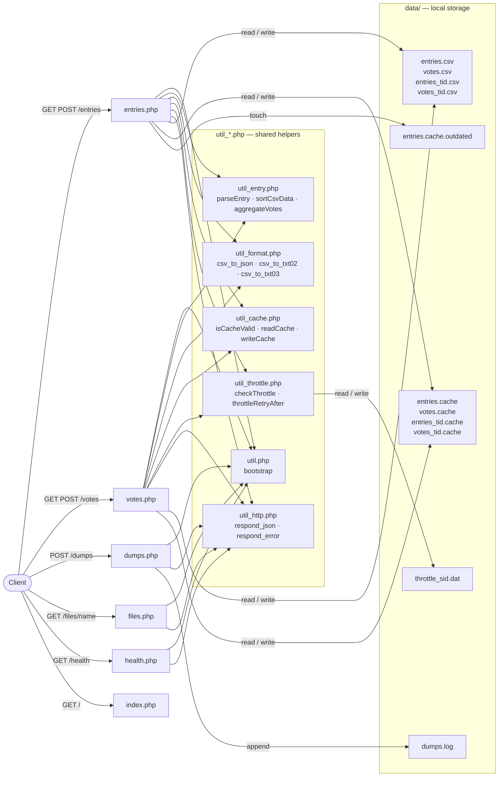
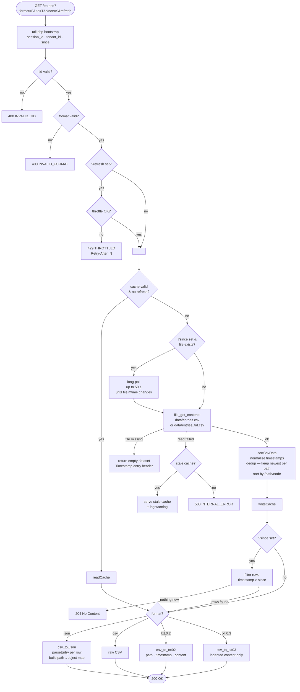
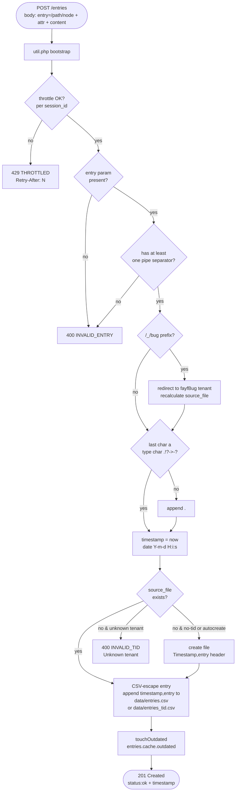

# InfoPedia PHP — Process Flow Diagrams

## 1. Routing & File Structure

---

## 2. GET /entries — Read Flow

_GET /votes follows the same shape; the only difference is an `aggregateVotes()` step after `sortCsvData()`._

---

## 3. POST /entries — Write Flow

_POST /votes follows the same shape; it adds a validation step that the entry contains a `votes:<sid>:<n>` attribute._

