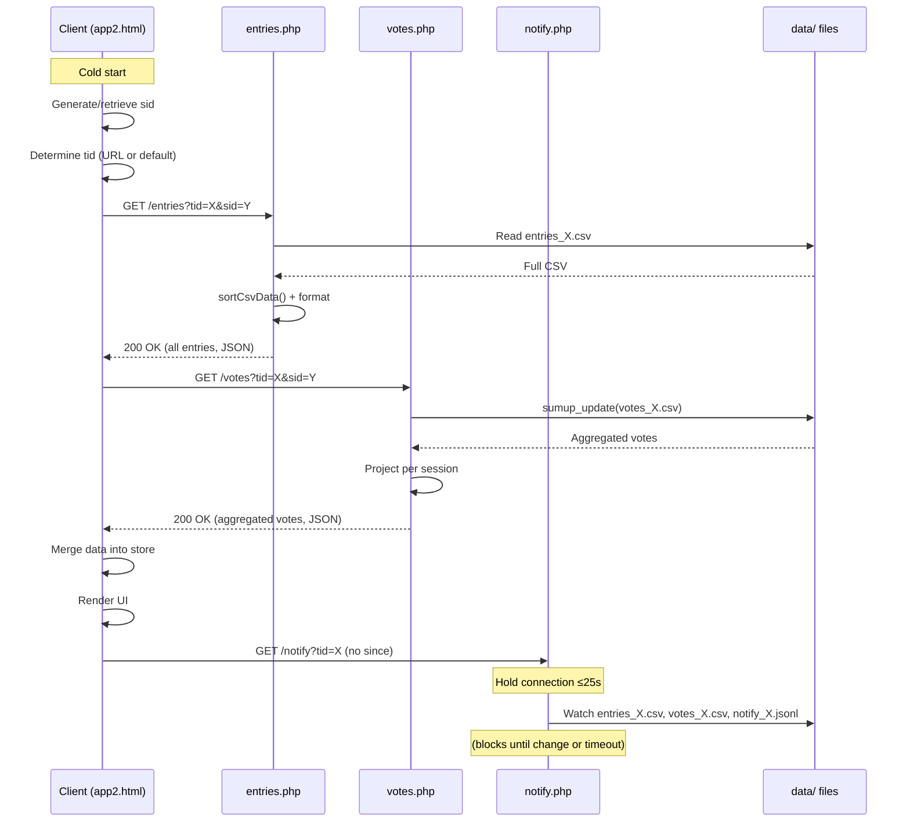
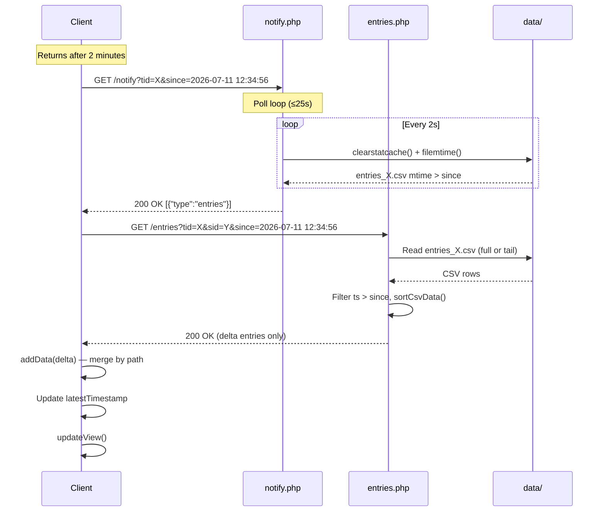
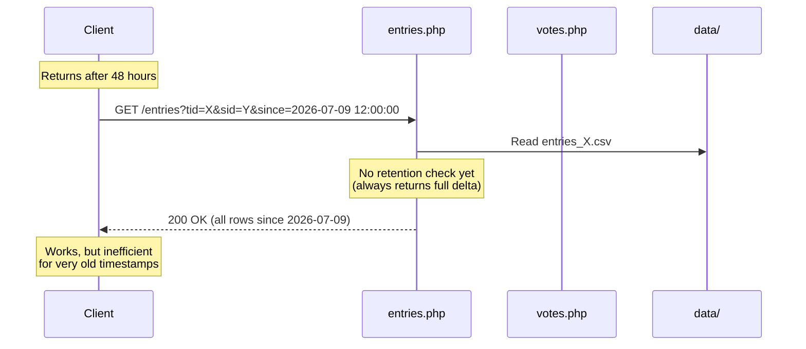
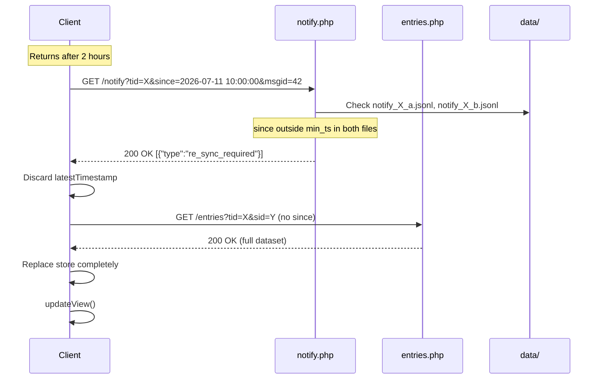
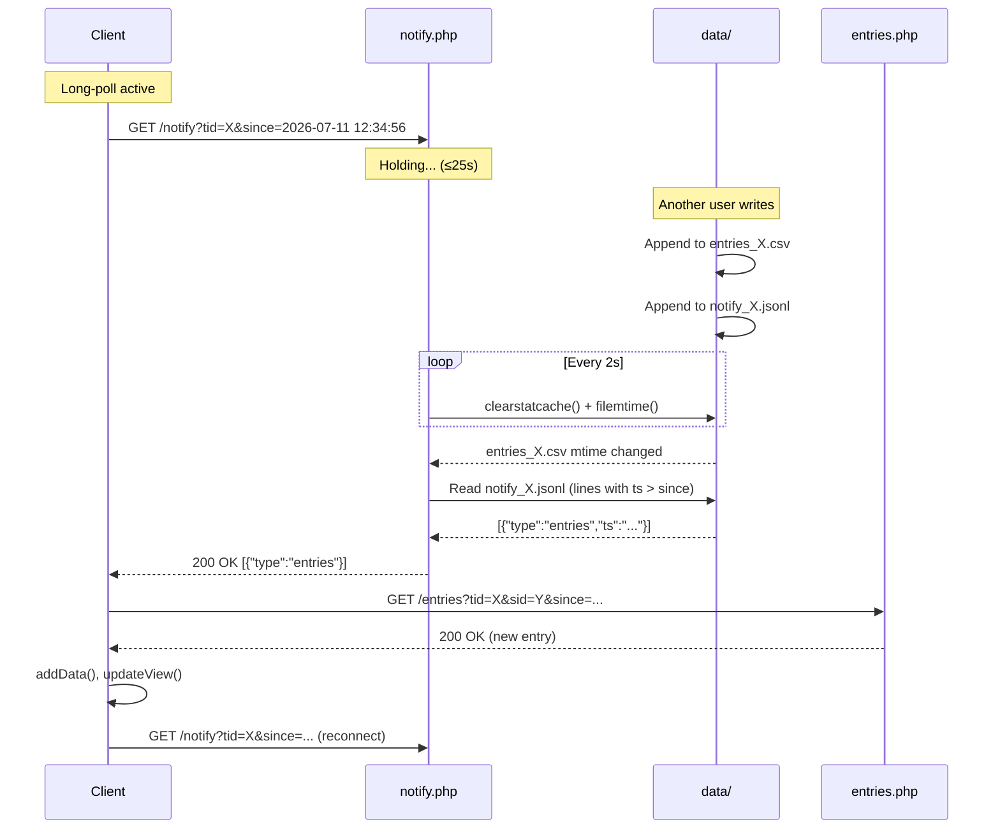
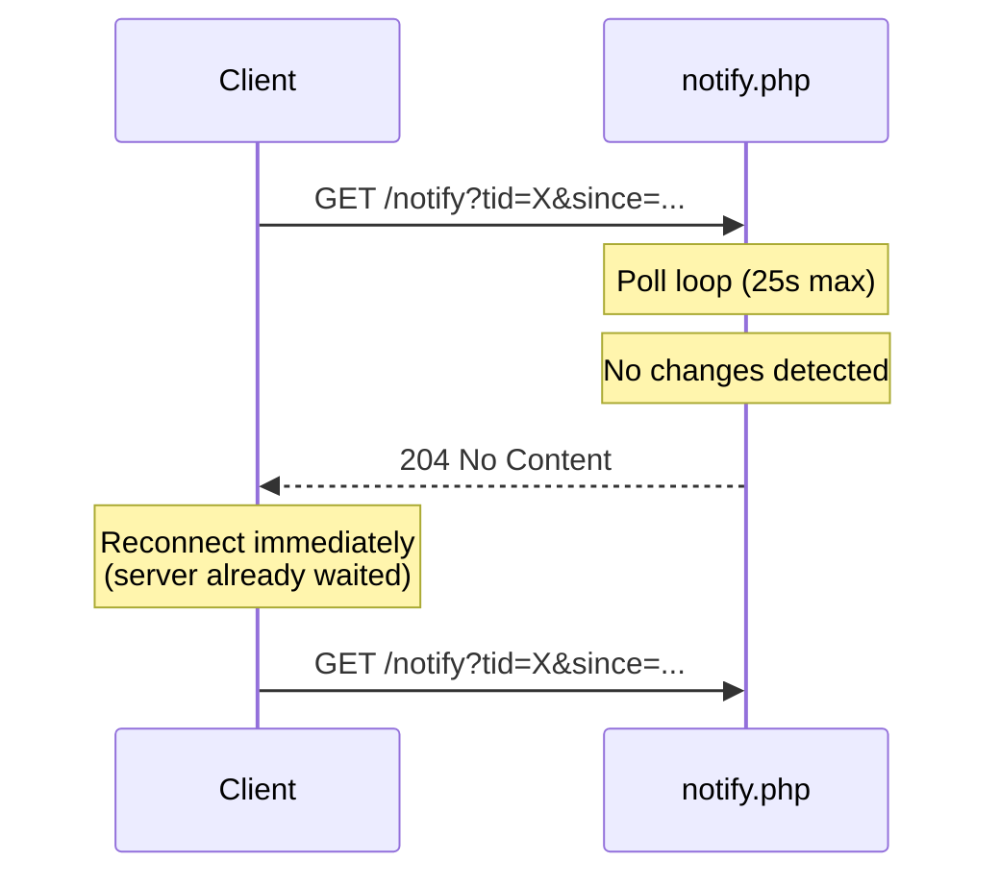

# InfoPedia API — Client-Side Operations

> 📚 **Navigation:** [Docs Index](./README.md) → [API Operations](./api-operations.md) → **Client-Side Scenarios**
>
> **Related Modules:** [Server-Side](./api-operations-server.md) · [Architecture](./api-operations-architecture.md) · [Use Cases](./api-use-cases-client.md)

This module covers **how clients interact with the InfoPedia API**, from initial load through real-time synchronization. For detailed use case definitions with error handling, see [API Use Cases § Client-Side](./api-use-cases-client.md).

---

## 1.1 Initial Client Sync (Cold Start)

**Trigger:** User opens the app for the first time or after clearing browser storage.  
**Use Case:** [UC-C1: Initial App Load](./api-use-cases-client.md#uc-c1-initial-app-load)

### Process

1. Client generates or retrieves session ID (`sid`)
2. Client determines tenant ID (`tid`) from URL or settings
3. Client performs full data fetch
4. Client establishes notify connection

### Sequence Diagram

**Key Points:**
- No `since` parameter on first `/entries` and `/notify` calls
- Client stores `latestTimestamp` from entries response
- Notify connection established **after** initial data load
- `/votes` always returns full aggregated state (no incremental)

**Config:**
- `[entry] sumup_enabled = false` → full CSV read + sortCsvData()
- `[entry] sumup_enabled = true` → snapshot + tail merge

---

## 1.2 Catchup During Retention Time

**Trigger:** User returns to app after brief absence (seconds to minutes).  
**Use Case:** [UC-C2: Incremental Sync (Within Retention)](./api-use-cases-client.md#uc-c2-incremental-sync-within-retention)

### Process

1. Client has `latestTimestamp` stored (e.g., `2026-07-11 12:34:56`)
2. Notify connection returns `{"type":"entries"}` event
3. Client fetches incremental delta using `since`
4. Client merges delta into existing data

### Sequence Diagram

**Key Points:**
- `since` parameter filters server-side (outer CSV timestamp)
- Client must merge by **path** (not append) to handle updates
- Vote changes trigger full re-fetch of `/votes` (no `since` support)
- Incremental notify files (future) will carry payloads directly

**Retention Window:**
- Currently: unlimited (full CSV always readable)
- Future (with incremental notify): ~50–75s (2–3× poll_timeout)

---

## 1.3 Catchup After Retention Time (Long Offline)

**Trigger:** User returns after hours/days offline.  
**Use Case:** [UC-C3: Full Re-Sync (Outside Retention)](./api-use-cases-client.md#uc-c3-full-re-sync-outside-retention)

### Process

1. Client attempts incremental sync with old `since` timestamp
2. Server determines client is outside retention window (future feature)
3. Server responds with status indicating full re-sync needed
4. Client discards old data and performs cold start flow

### Sequence Diagram (Current Implementation)

### Sequence Diagram (Future with Incremental Notify)

**Key Points:**
- Current: no retention enforcement (always incremental-capable)
- Future: rotating notify files have finite history
- `re_sync_required` event triggers full cold start
- Client must **replace** data, not merge (paths may have been deleted)

---

## 1.4 Receiving Real-Time Notifications

**Trigger:** Server-side write (entry, vote, or explicit message).  
**Use Case:** [UC-C4: Real-Time Event Handling](./api-use-cases-client.md#uc-c4-real-time-event-handling)

### Process

1. Client has active long-poll connection to `/notify`
2. Server detects file mtime change or explicit notify write
3. Server responds with event array
4. Client handles each event type appropriately

### Sequence Diagram

**Event Types:**

| Event | Trigger | Client Action |
|-------|---------|---------------|
| `{"type":"entries"}` | entries_X.csv mtime OR notify append | Fetch delta from `/entries?since=...` |
| `{"type":"votes"}` | votes_X.csv mtime OR notify append | Fetch full state from `/votes` |
| `{"type":"message","text":"..."}` | Explicit `append_notify()` call | Show toast (no data fetch) |

**Timeout Handling:**

**Key Points:**
- `204 No Content` = timeout, not error
- Client must reconnect immediately after 204
- Server sleep(2) means max latency = 2s
- Multiple events batched in same response if they occur within 2s window

---

**Last Updated:** 2026-07-11  
**Related:** [API Use Cases § Client-Side](./api-use-cases-client.md) · [Backend Communication](./backend-communication.md)

