# InfoPedia API — Server-Side Operations

> 📚 **Navigation:** [Docs Index](./README.md) → [API Operations](./api-operations.md) → **Server-Side Scenarios**
>
> **Related Modules:** [Client-Side](./api-operations-client.md) · [Architecture](./api-operations-architecture.md) · [Use Cases](./api-use-cases-server.md)

This module covers **server-side operations**, including tenant provisioning, data ingestion, notification broadcasting, and sumup snapshot management. For detailed use case definitions with error handling, see [API Use Cases § Server-Side](./api-use-cases-server.md).

---

## 2.1 New Tenant Initialization

**Trigger:** First POST request to a tenant that has no data files yet.  
**Use Case:** [UC-S1: Tenant Provisioning](./api-use-cases-server.md#uc-s1-tenant-provisioning)

### Process

1. Client sends POST with new `tid`
2. Server validates tenant ID format (`[a-zA-Z0-9_-]{1,30}`)
3. Server creates CSV file on first write (atomic)
4. No explicit provisioning needed

### Sequence Diagram

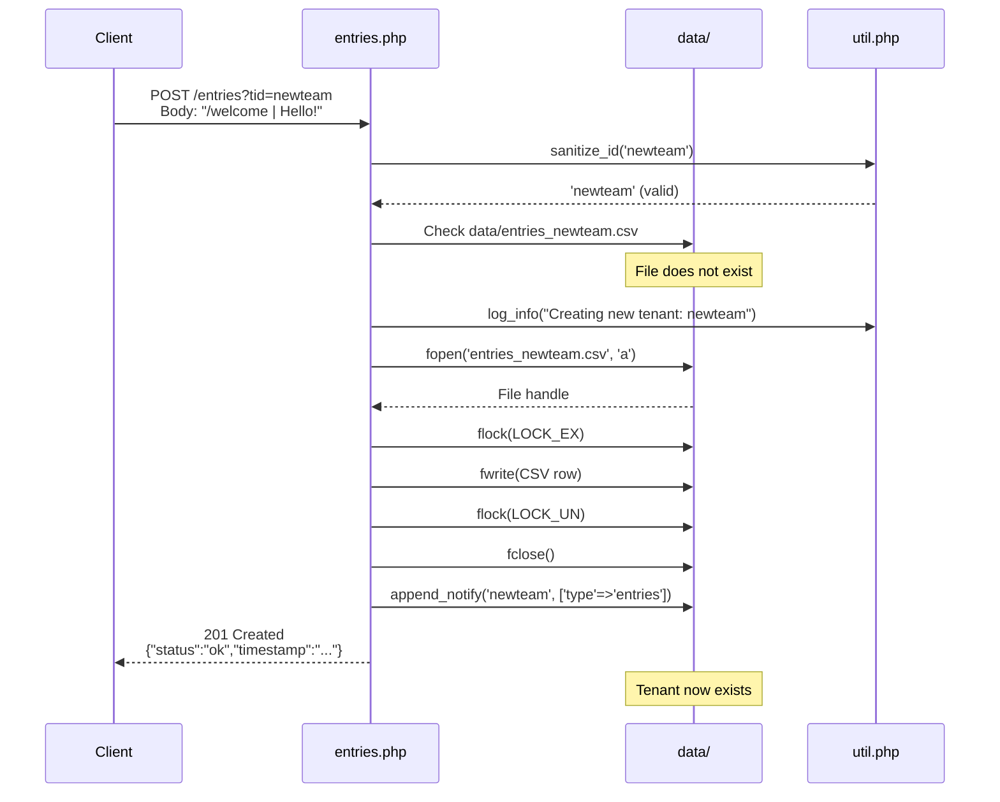

**Key Points:**
- No pre-provisioning or admin action required
- Tenant ID validation prevents directory traversal
- First write creates file atomically with `flock()`
- Empty tenants (no files) appear as 404 on GET until first write
- Sumup snapshots created on-demand on first read

**Config:**
- No tenant-specific config needed
- All tenants share `infopedia.cfg` settings
- Data isolation via filename: `entries_<tid>.csv`, `votes_<tid>.csv`

---

## 2.2 Add Entry

**Trigger:** `POST /entries` from client or API consumer.  
**Use Case:** [UC-S2: Entry Ingestion](./api-use-cases-server.md#uc-s2-entry-ingestion)

### Process

1. Parse and validate entry format
2. Append to CSV with server-generated timestamp
3. Invalidate cache
4. Notify connected clients
5. Update sumup snapshot (if enabled)

### Sequence Diagram

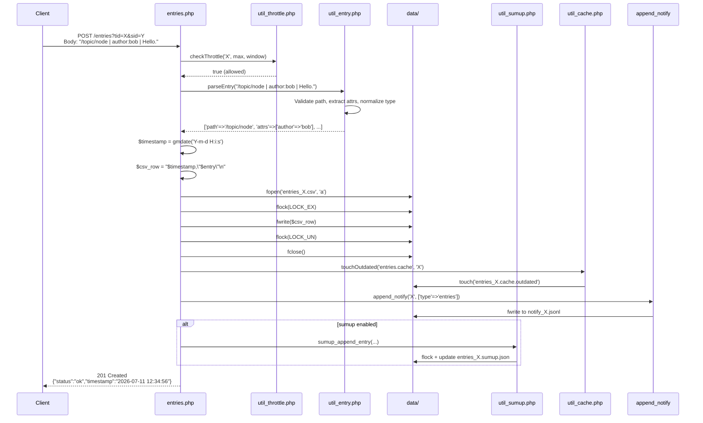

**Validation:**

```php
// In util_entry.php::parseEntry()
if (!preg_match('#^/[a-zA-Z0-9_/-]+$#', $path)) {
    throw new Exception("Invalid path format");
}
if (empty($content)) {
    throw new Exception("Content required");
}
// Type normalization: append '.' if last char not in [.!?>-]
```

**Throttling:**
- Config: `throttle_max`, `throttle_window`, `throttle_key` (sid or ip)
- State: `data/throttle_<key>.dat` — `<window_start>:<count>`
- On 429: `Retry-After: <seconds>` header + error envelope

**Cache Invalidation:**
- `touchOutdated()` creates `.outdated` marker file
- Next GET sees stale cache + outdated marker → rebuild
- Sumup snapshot updated incrementally (no rebuild unless `?refresh=1`)

---

## 2.3 Add Vote

**Trigger:** `POST /votes` from client.  
**Use Case:** [UC-S3: Vote Recording](./api-use-cases-server.md#uc-s3-vote-recording)

### Process

1. Validate vote format: `votes:<sid>:<n>` attribute
2. Append to votes CSV
3. Update sumup snapshot (incremental aggregation)
4. Notify connected clients

### Sequence Diagram

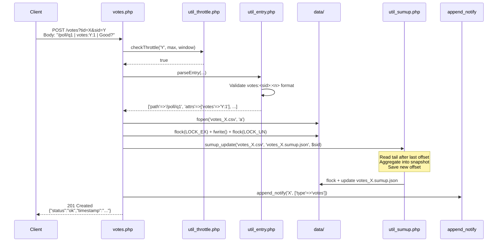

**Vote Aggregation (Sumup):**

```json
{
  "src": "votes_X.csv",
  "offset": 1234,
  "nodes": {
    "/poll/q1": {
      "votes": {
        "sid_abc": {"count": 3, "signers": ["sid_abc"]},
        "sid_def": {"count": -1, "signers": ["sid_def"]}
      },
      "newest_ts": "2026-07-11 12:34:56",
      "content": "Good?"
    }
  }
}
```

**Projection (in GET /votes):**
- Own session: `votes:<sid>:<own_total>`
- Others: `votes:others:<sum_of_all_other_sids>`
- Result: `/poll/q1 | votes:sid_abc:3 | votes:others:-1 | Good?`

**Key Points:**
- Votes CSV is append-only (no deletion)
- Sumup snapshot enables O(tail) aggregation instead of O(full CSV)
- Concurrent writes safe via `flock(LOCK_EX)`
- Vote changes always trigger full `/votes` re-fetch (no incremental client-side aggregation yet)

---

## 2.4 Add Notification

**Trigger:** Explicit server-side call to `append_notify()` or automatic on CSV write.  
**Use Case:** [UC-S4: Notification Broadcasting](./api-use-cases-server.md#uc-s4-notification-broadcasting)

### Process

1. Server code calls `append_notify($tid, $event)`
2. Event written to `notify_<tid>.jsonl` (one JSON object per line)
3. All connected long-poll clients receive event on next wake cycle

### Sequence Diagram

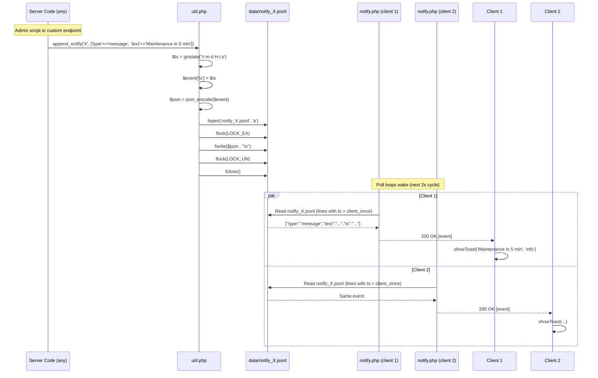

**Event Types:**

| Type | Payload | Trigger |
|------|---------|---------|
| `entries` | `{"type":"entries","ts":"..."}` | Automatic on POST /entries or CSV write |
| `votes` | `{"type":"votes","ts":"..."}` | Automatic on POST /votes or CSV write |
| `message` | `{"type":"message","text":"...","ts":"..."}` | Explicit `append_notify()` call |

**File Format (notify_X.jsonl):**

```
{"type":"entries","ts":"2026-07-11 12:34:56"}
{"type":"votes","ts":"2026-07-11 12:35:10"}
{"type":"message","text":"System maintenance in 5 minutes","ts":"2026-07-11 12:40:00"}
```

**Key Points:**
- JSONL format: one event per line, no commas, no array wrapper
- Events include `ts` field for filtering by `since`
- Automatic append on CSV writes (belt-and-suspenders with mtime check)
- No rotation yet (file grows unbounded) — future: see §2.5

---

## 2.5 Switch Notification Partition

**Trigger:** Notification file exceeds size limit or retention time.  
**Use Case:** [UC-S5: Notification Partition Rotation](./api-use-cases-server.md#uc-s5-notification-partition-rotation)  
**Status:** **Not yet implemented** — planned for incremental notify feature.

### Planned Process

1. Active partition: `notify_<tid>_a.jsonl`
2. Inactive partition: `notify_<tid>_b.jsonl`
3. Both partitions written in parallel (dual-write)
4. Rotation triggered when active partition is old + oversized
5. Swap: inactive becomes active, old active archived/deleted

### Planned Sequence Diagram

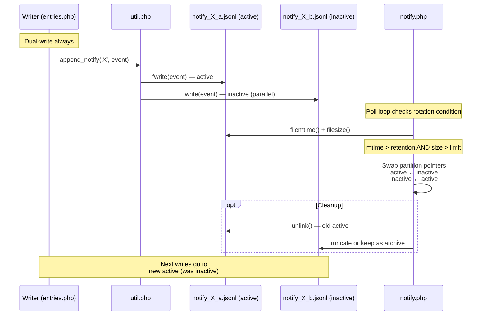

**Rotation Conditions:**

```php
// In notify.php (planned)
$retention = (int)($config['notify_retention'] ?? 60);  // seconds
$max_size = (int)($config['notify_max_size'] ?? 1048576);  // bytes

$active_file = "data/notify_{$tid}_a.jsonl";
$mtime = filemtime($active_file);
$size = filesize($active_file);

if ($size > 0 && (time() - $mtime > $retention) && $size > $max_size) {
    rotate_partition($tid);
}
```

**Key Points:**
- Dual-write ensures no message loss during rotation
- Inactive partition is pre-filled with messages beyond retention window
- Clients outside retention window get `re_sync_required` event
- Rotation is atomic from client perspective (no mid-rotation corruption)

---

## 2.6 Full Data from Entries/Votes Log

**Trigger:** GET request without `since` parameter, or cache rebuild.  
**Use Case:** [UC-S6: Full Data Export](./api-use-cases-server.md#uc-s6-full-data-export)

### Process (Entries)

1. Read full CSV file
2. Sort by path (column 1), dedup by latest timestamp
3. Apply delete markers (`--`)
4. Format and respond

### Sequence Diagram (Entries, sumup disabled)

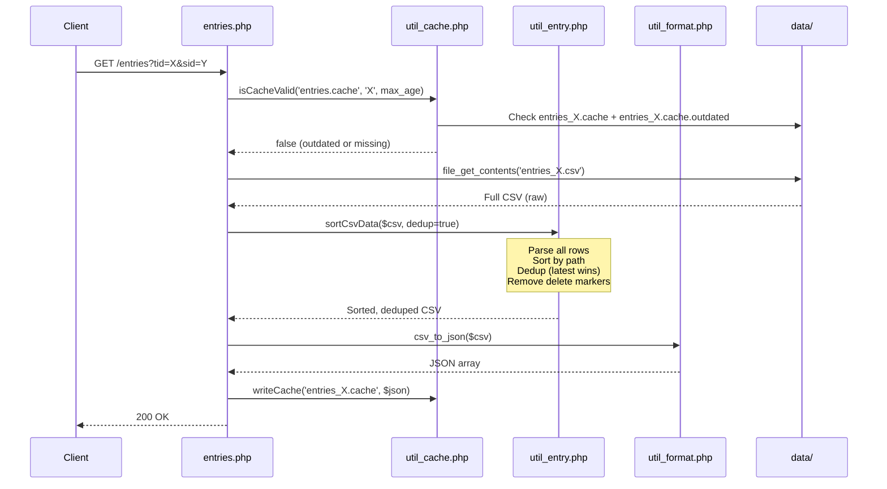

### Process (Votes)

1. Read votes CSV file
2. Load/update sumup snapshot (aggregate by path + sid)
3. Project for requesting session (`votes:<sid>:<n>` + `votes:others:<n>`)
4. Format and respond

### Sequence Diagram (Votes)

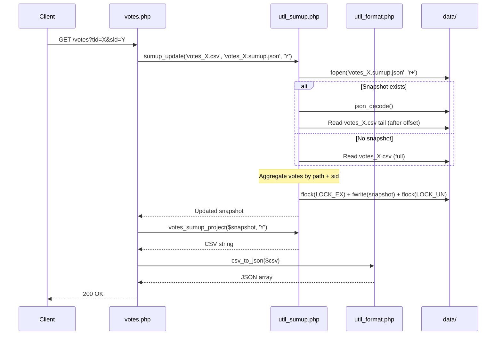

**Key Points:**
- Sumup snapshots enable O(tail) instead of O(full file)
- Output is byte-compatible with `sortCsvData()` (verified by golden tests)
- `?refresh=1` forces snapshot discard and full rebuild (throttled)
- Cache sits on top of sumup (two-tier optimization)

---

## 2.7 SumUp Operations

**Use Case:** [UC-S7: SumUp Snapshot Management](./api-use-cases-server.md#uc-s7-sumup-snapshot-management)

SumUp snapshots enable incremental aggregation of CSV append-only logs. Four operations:

### 2.7.1 Init (First Read)

**Trigger:** First GET request to a tenant, or after `just sumup-clean`.

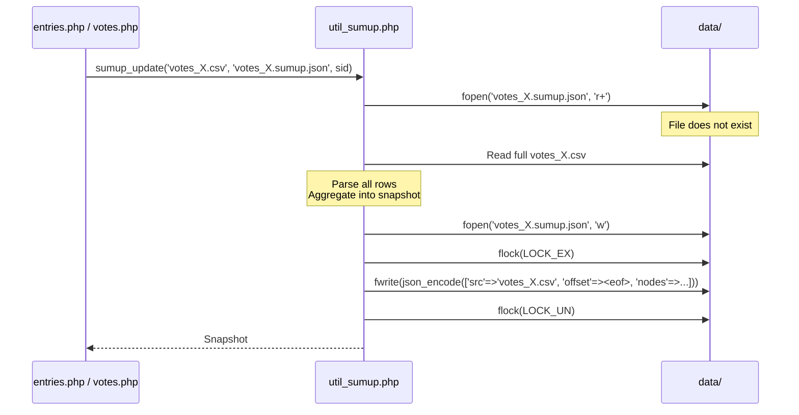

**Key Points:**
- Full CSV read on first access (cold start)
- Subsequent reads use incremental mode
- Init is O(full file), but only happens once per tenant

---

### 2.7.2 Running Delta (Incremental Update)

**Trigger:** GET request when snapshot exists and is valid.

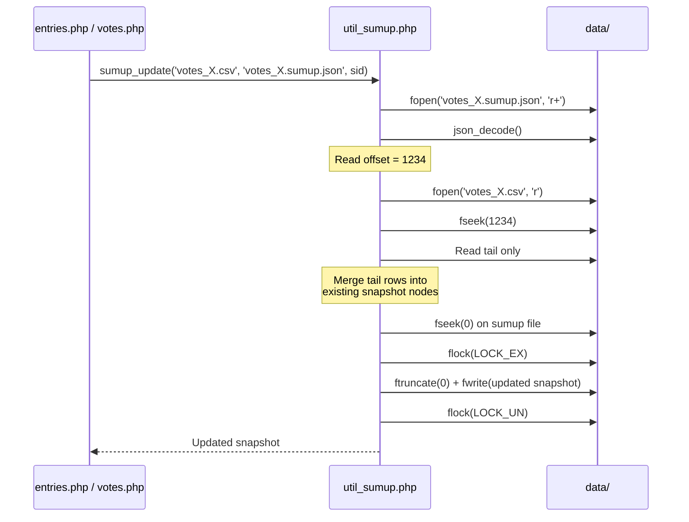

**Key Points:**
- Read CSV tail only (after stored offset)
- O(tail) complexity, not O(full file)
- Offset advances to new EOF
- Concurrent reads safe (older-snapshot-wins on conflict)

---

### 2.7.3 Increment (Append on Write)

**Trigger:** POST /votes or POST /entries (if sumup enabled for entries).

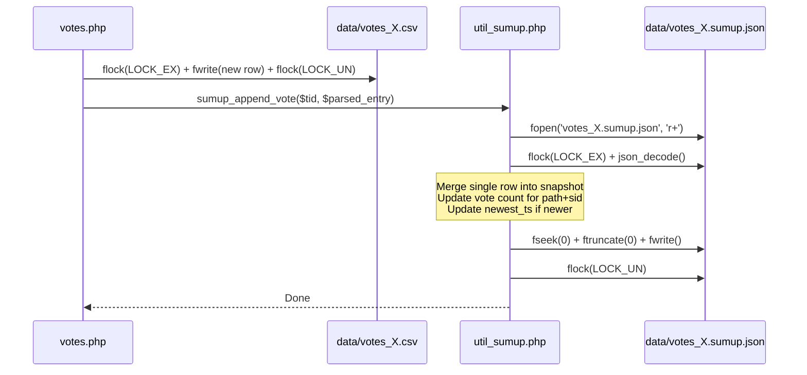

**Key Points:**
- Append updates snapshot immediately (no stale reads)
- Single row merge is O(1)
- Lock ordering: CSV first, then sumup (prevents deadlock)
- Offset incremented by byte count of appended row

---

### 2.7.4 Re-create (Full Rebuild)

**Trigger:** `?refresh=1` query param (throttled), or corrupted snapshot detected.

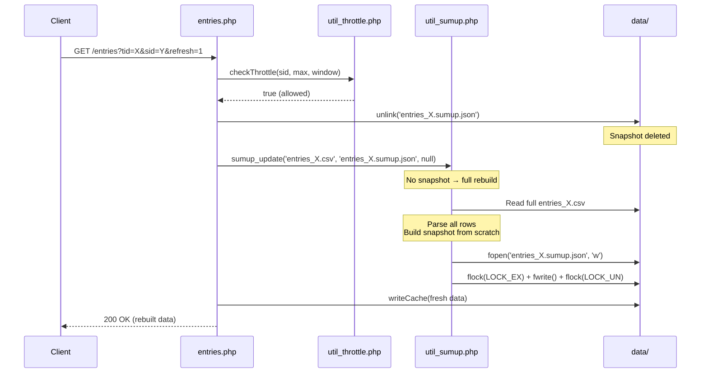

**Key Points:**
- Throttled to prevent abuse (same as cache refresh)
- Deletes snapshot before rebuild (ensures clean state)
- Full rebuild is O(full file), but rare
- Used for recovery after corruption or offset mismatch

**Offset Mismatch Detection:**

```php
// In util_sumup.php
$snapshot = json_decode(file_get_contents($sumup_file), true);
$csv_size = filesize($csv_file);

if ($snapshot['offset'] > $csv_size) {
    // CSV was truncated or replaced → full rebuild
    unlink($sumup_file);
    return sumup_init($csv_file, $sumup_file, $sid);
}
```

---

**Last Updated:** 2026-07-11  
**Related:** [API Use Cases § Server-Side](./api-use-cases-server.md) · [Backend Communication](./backend-communication.md)

