# InfoPedia API — Technical Operations Guide

> **Audience:** Backend developers, operations, integrators  
> **Status:** Living document — updated with notify + sumup implementation (2026-07)  
> **Related:** [`api_spec.md`](../.ai/api_spec.md) · [`backend-communication.md`](./backend-communication.md) · [`backend-communication-concept.md`](./backend-communication-concept.md) · [`api-use-cases.md`](./api-use-cases.md)

---

## Purpose

This document explains **how the InfoPedia API works in practice**, covering both client-side and server-side operational scenarios with sequence diagrams and references to concrete use cases.

For endpoint contracts and data formats, see [`api_spec.md`](../.ai/api_spec.md).

---

## Table of Contents

1. [Client-Side Scenarios](#1-client-side-scenarios)
   - [1.1 Initial Client Sync (Cold Start)](#11-initial-client-sync-cold-start)
   - [1.2 Catchup During Retention Time](#12-catchup-during-retention-time)
   - [1.3 Catchup After Retention Time (Long Offline)](#13-catchup-after-retention-time-long-offline)
   - [1.4 Receiving Real-Time Notifications](#14-receiving-real-time-notifications)

2. [Server-Side Scenarios](#2-server-side-scenarios)
   - [2.1 New Tenant Initialization](#21-new-tenant-initialization)
   - [2.2 Add Entry](#22-add-entry)
   - [2.3 Add Vote](#23-add-vote)
   - [2.4 Add Notification](#24-add-notification)
   - [2.5 Switch Notification Partition](#25-switch-notification-partition)
   - [2.6 Full Data from Entries/Votes Log](#26-full-data-from-entriesvotes-log)
   - [2.7 SumUp Operations](#27-sumup-operations)

3. [Data Flow Architecture](#3-data-flow-architecture)

---

## 1. Client-Side Scenarios

### 1.1 Initial Client Sync (Cold Start)

**Trigger:** User opens the app for the first time or after clearing browser storage.  
**Use Case:** [UC-C1: Initial App Load](./api-use-cases.md#uc-c1-initial-app-load)

#### Process

1. Client generates or retrieves session ID (`sid`)
2. Client determines tenant ID (`tid`) from URL or settings
3. Client performs full data fetch
4. Client establishes notify connection

#### Sequence Diagram

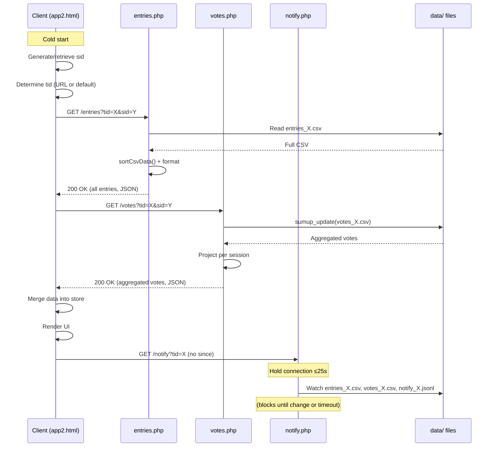
```mermaid
sequenceDiagram
    participant C as Client (app2.html)
    participant E as entries.php
    participant V as votes.php
    participant N as notify.php
    participant D as data/ files

    Note over C: Cold start
    C->>C: Generate/retrieve sid
    C->>C: Determine tid (URL or default)
    
    C->>E: GET /entries?tid=X&sid=Y
    E->>D: Read entries_X.csv
    D-->>E: Full CSV
    E->>E: sortCsvData() + format
    E-->>C: 200 OK (all entries, JSON)
    
    C->>V: GET /votes?tid=X&sid=Y
    V->>D: sumup_update(votes_X.csv)
    D-->>V: Aggregated votes
    V->>V: Project per session
    V-->>C: 200 OK (aggregated votes, JSON)
    
    C->>C: Merge data into store
    C->>C: Render UI
    
    C->>N: GET /notify?tid=X (no since)
    Note over N: Hold connection ≤25s
    N->>D: Watch entries_X.csv, votes_X.csv, notify_X.jsonl
    Note over N: (blocks until change or timeout)
```

**Key Points:**
- No `since` parameter on first `/entries` and `/notify` calls
- Client stores `latestTimestamp` from entries response
- Notify connection established **after** initial data load
- `/votes` always returns full aggregated state (no incremental)

**Config:**
- `[entry] sumup_enabled = false` → full CSV read + sortCsvData()
- `[entry] sumup_enabled = true` → snapshot + tail merge

---

### 1.2 Catchup During Retention Time

**Trigger:** User returns to app after brief absence (seconds to minutes).  
**Use Case:** [UC-C2: Incremental Sync (Within Retention)](./api-use-cases.md#uc-c2-incremental-sync-within-retention)

#### Process

1. Client has `latestTimestamp` stored (e.g., `2026-07-11 12:34:56`)
2. Notify connection returns `{"type":"entries"}` event
3. Client fetches incremental delta using `since`
4. Client merges delta into existing data

#### Sequence Diagram

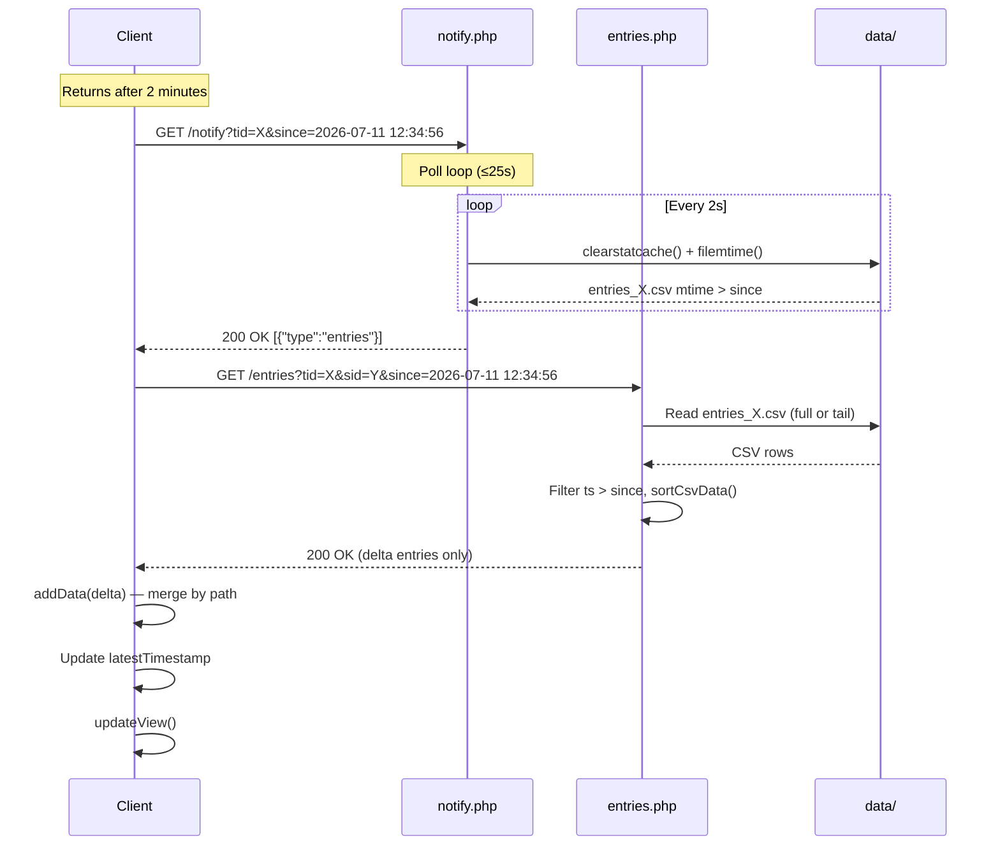
```mermaid
sequenceDiagram
    participant C as Client
    participant N as notify.php
    participant E as entries.php
    participant D as data/

    Note over C: Returns after 2 minutes
    C->>N: GET /notify?tid=X&since=2026-07-11 12:34:56
    
    Note over N: Poll loop (≤25s)
    loop Every 2s
        N->>D: clearstatcache() + filemtime()
        D-->>N: entries_X.csv mtime > since
    end
    
    N-->>C: 200 OK [{"type":"entries"}]
    
    C->>E: GET /entries?tid=X&sid=Y&since=2026-07-11 12:34:56
    E->>D: Read entries_X.csv (full or tail)
    D-->>E: CSV rows
    E->>E: Filter ts > since, sortCsvData()
    E-->>C: 200 OK (delta entries only)
    
    C->>C: addData(delta) — merge by path
    C->>C: Update latestTimestamp
    C->>C: updateView()
```

**Key Points:**
- `since` parameter filters server-side (outer CSV timestamp)
- Client must merge by **path** (not append) to handle updates
- Vote changes trigger full re-fetch of `/votes` (no `since` support)
- Incremental notify files (future) will carry payloads directly

**Retention Window:**
- Currently: unlimited (full CSV always readable)
- Future (with incremental notify): ~50–75s (2–3× poll_timeout)

---

### 1.3 Catchup After Retention Time (Long Offline)

**Trigger:** User returns after hours/days offline.  
**Use Case:** [UC-C3: Full Re-Sync (Outside Retention)](./api-use-cases.md#uc-c3-full-re-sync-outside-retention)

#### Process

1. Client attempts incremental sync with old `since` timestamp
2. Server determines client is outside retention window (future feature)
3. Server responds with status indicating full re-sync needed
4. Client discards old data and performs cold start flow

#### Sequence Diagram (Current Implementation)

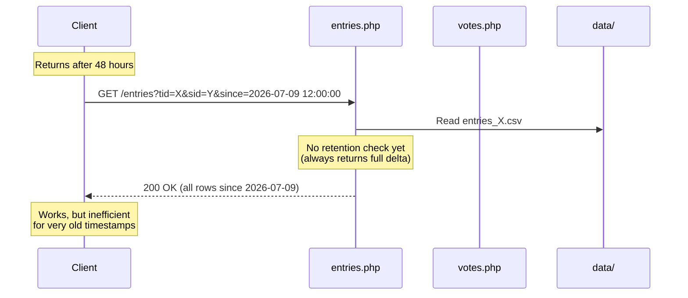
```mermaid
sequenceDiagram
    participant C as Client
    participant E as entries.php
    participant V as votes.php
    participant D as data/

    Note over C: Returns after 48 hours
    C->>E: GET /entries?tid=X&sid=Y&since=2026-07-09 12:00:00
    E->>D: Read entries_X.csv
    Note over E: No retention check yet<br/>(always returns full delta)
    E-->>C: 200 OK (all rows since 2026-07-09)
    
    Note over C: Works, but inefficient<br/>for very old timestamps
```

#### Sequence Diagram (Future with Incremental Notify)

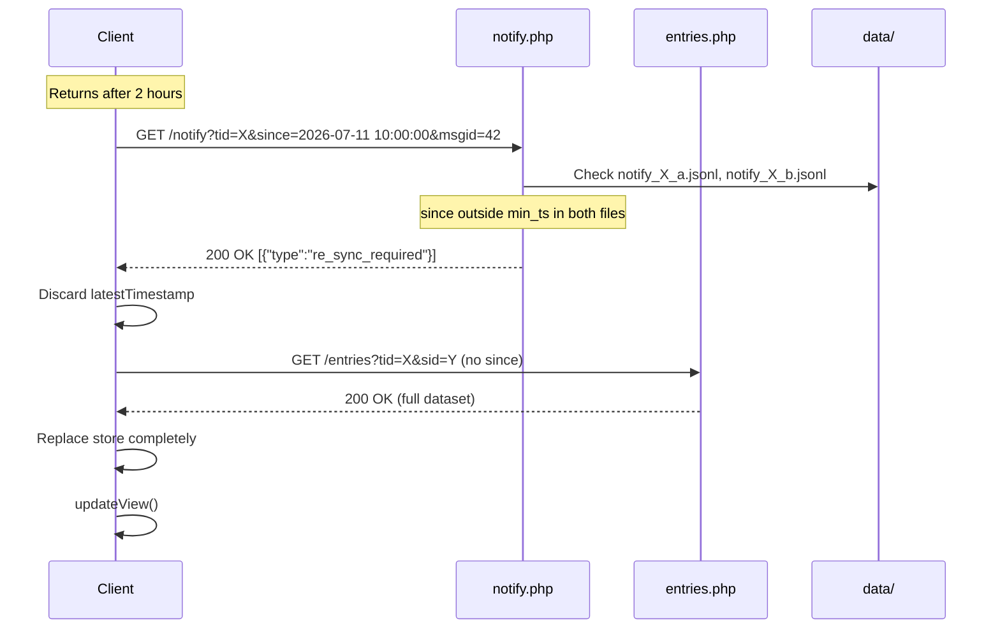
```mermaid
sequenceDiagram
    participant C as Client
    participant N as notify.php
    participant E as entries.php
    participant D as data/

    Note over C: Returns after 2 hours
    C->>N: GET /notify?tid=X&since=2026-07-11 10:00:00&msgid=42
    N->>D: Check notify_X_a.jsonl, notify_X_b.jsonl
    Note over N: since outside min_ts in both files
    N-->>C: 200 OK [{"type":"re_sync_required"}]
    
    C->>C: Discard latestTimestamp
    C->>E: GET /entries?tid=X&sid=Y (no since)
    E-->>C: 200 OK (full dataset)
    
    C->>C: Replace store completely
    C->>C: updateView()
```

**Key Points:**
- Current: no retention enforcement (always incremental-capable)
- Future: rotating notify files have finite history
- `re_sync_required` event triggers full cold start
- Client must **replace** data, not merge (paths may have been deleted)

---

### 1.4 Receiving Real-Time Notifications

**Trigger:** Server-side write (entry, vote, or explicit message).  
**Use Case:** [UC-C4: Real-Time Event Handling](./api-use-cases.md#uc-c4-real-time-event-handling)

#### Process

1. Client has active long-poll connection to `/notify`
2. Server detects file mtime change or explicit notify write
3. Server responds with event array
4. Client handles each event type appropriately

#### Sequence Diagram

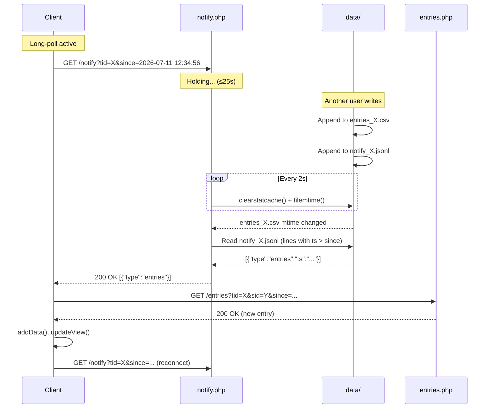
```mermaid
sequenceDiagram
    participant C as Client
    participant N as notify.php
    participant D as data/
    participant E as entries.php

    Note over C: Long-poll active
    C->>N: GET /notify?tid=X&since=2026-07-11 12:34:56
    Note over N: Holding... (≤25s)
    
    Note over D: Another user writes
    D->>D: Append to entries_X.csv
    D->>D: Append to notify_X.jsonl
    
    loop Every 2s
        N->>D: clearstatcache() + filemtime()
    end
    
    D-->>N: entries_X.csv mtime changed
    N->>D: Read notify_X.jsonl (lines with ts > since)
    D-->>N: [{"type":"entries","ts":"..."}]
    
    N-->>C: 200 OK [{"type":"entries"}]
    
    C->>E: GET /entries?tid=X&sid=Y&since=...
    E-->>C: 200 OK (new entry)
    C->>C: addData(), updateView()
    
    C->>N: GET /notify?tid=X&since=... (reconnect)
```

**Event Types:**

| Event | Trigger | Client Action |
|-------|---------|---------------|
| `{"type":"entries"}` | entries_X.csv mtime OR notify append | Fetch delta from `/entries?since=...` |
| `{"type":"votes"}` | votes_X.csv mtime OR notify append | Fetch full state from `/votes` |
| `{"type":"message","text":"..."}` | Explicit `append_notify()` call | Show toast (no data fetch) |

**Timeout Handling:**

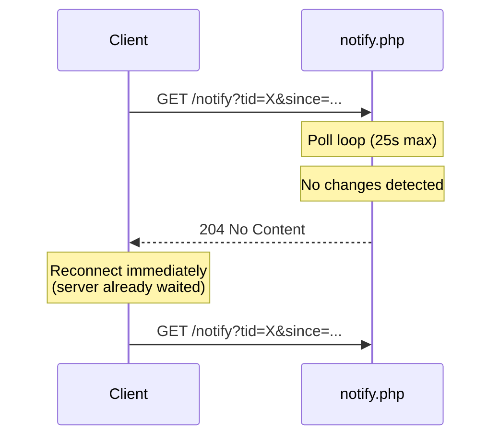
```mermaid
sequenceDiagram
    participant C as Client
    participant N as notify.php

    C->>N: GET /notify?tid=X&since=...
    Note over N: Poll loop (25s max)
    Note over N: No changes detected
    N-->>C: 204 No Content
    
    Note over C: Reconnect immediately<br/>(server already waited)
    C->>N: GET /notify?tid=X&since=...
```

**Key Points:**
- `204 No Content` = timeout, not error
- Client must reconnect immediately after 204
- Server sleep(2) means max latency = 2s
- Multiple events batched in same response if they occur within 2s window

---

## 2. Server-Side Scenarios

### 2.1 New Tenant Initialization

**Trigger:** First POST request to a tenant that has no data files yet.  
**Use Case:** [UC-S1: Tenant Provisioning](./api-use-cases.md#uc-s1-tenant-provisioning)

#### Process

1. Client sends POST with new `tid`
2. Server validates tenant ID format (`[a-zA-Z0-9_-]{1,30}`)
3. Server creates CSV file on first write (atomic)
4. No explicit provisioning needed

#### Sequence Diagram

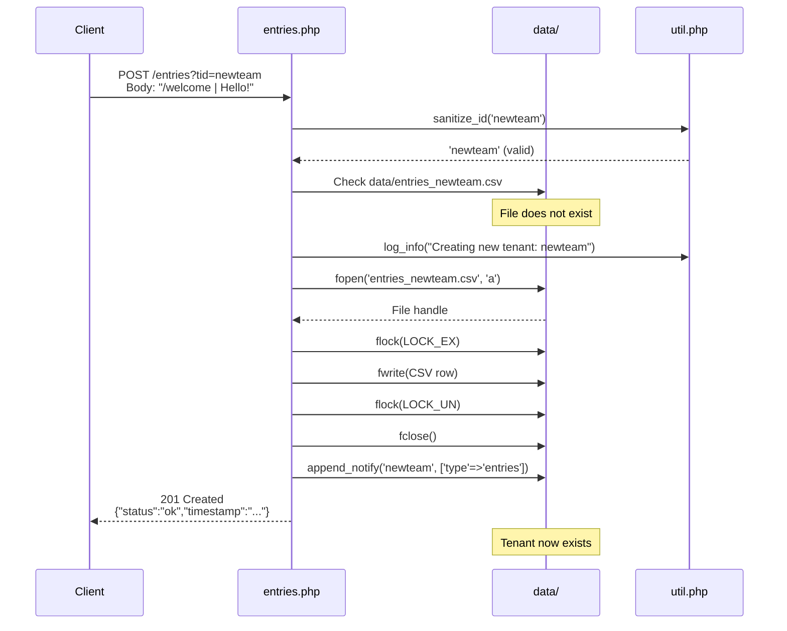
```mermaid
sequenceDiagram
    participant C as Client
    participant E as entries.php
    participant D as data/
    participant U as util.php

    C->>E: POST /entries?tid=newteam<br/>Body: "/welcome | Hello!"
    E->>U: sanitize_id('newteam')
    U-->>E: 'newteam' (valid)
    
    E->>D: Check data/entries_newteam.csv
    Note over D: File does not exist
    
    E->>U: log_info("Creating new tenant: newteam")
    E->>D: fopen('entries_newteam.csv', 'a')
    D-->>E: File handle
    
    E->>D: flock(LOCK_EX)
    E->>D: fwrite(CSV row)
    E->>D: flock(LOCK_UN)
    E->>D: fclose()
    
    E->>D: append_notify('newteam', ['type'=>'entries'])
    
    E-->>C: 201 Created<br/>{"status":"ok","timestamp":"..."}
    
    Note over D: Tenant now exists
```

**Key Points:**
- No pre-provisioning or admin action required
- Tenant ID validation prevents directory traversal
- First write creates file atomically with `flock()`
- Empty tenants (no files) appear as 404 on GET until first write
- Sumup snapshots created on-demand on first read

**Config:**
- No tenant-specific config needed
- All tenants share `infopedia.cfg` settings
- Data isolation via filename: `entries_<tid>.csv`, `votes_<tid>.csv`

---

### 2.2 Add Entry

**Trigger:** `POST /entries` from client or API consumer.  
**Use Case:** [UC-S2: Entry Ingestion](./api-use-cases.md#uc-s2-entry-ingestion)

#### Process

1. Parse and validate entry format
2. Append to CSV with server-generated timestamp
3. Invalidate cache
4. Notify connected clients
5. Update sumup snapshot (if enabled)

#### Sequence Diagram

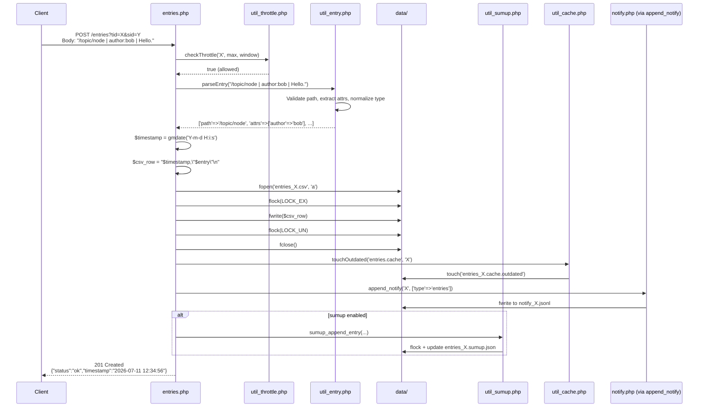
```mermaid
sequenceDiagram
    participant C as Client
    participant E as entries.php
    participant T as util_throttle.php
    participant U as util_entry.php
    participant D as data/
    participant S as util_sumup.php
    participant Ca as util_cache.php
    participant N as notify.php (via append_notify)

    C->>E: POST /entries?tid=X&sid=Y<br/>Body: "/topic/node | author:bob | Hello."
    
    E->>T: checkThrottle('X', max, window)
    T-->>E: true (allowed)
    
    E->>U: parseEntry("/topic/node | author:bob | Hello.")
    U->>U: Validate path, extract attrs, normalize type
    U-->>E: ['path'=>'/topic/node', 'attrs'=>['author'=>'bob'], ...]
    
    E->>E: $timestamp = gmdate('Y-m-d H:i:s')
    E->>E: $csv_row = "$timestamp,\"$entry\"\n"
    
    E->>D: fopen('entries_X.csv', 'a')
    E->>D: flock(LOCK_EX)
    E->>D: fwrite($csv_row)
    E->>D: flock(LOCK_UN)
    E->>D: fclose()
    
    E->>Ca: touchOutdated('entries.cache', 'X')
    Ca->>D: touch('entries_X.cache.outdated')
    
    E->>N: append_notify('X', ['type'=>'entries'])
    N->>D: fwrite to notify_X.jsonl
    
    alt sumup enabled
        E->>S: sumup_append_entry(...)
        S->>D: flock + update entries_X.sumup.json
    end
    
    E-->>C: 201 Created<br/>{"status":"ok","timestamp":"2026-07-11 12:34:56"}
```

**Validation:**

```php
// In util_entry.php::parseEntry()
if (!preg_match('#^/[a-zA-Z0-9_/-]+$#', $path)) {
    throw new Exception("Invalid path format");
}
if (empty($content)) {
    throw new Exception("Content required");
}
// Type normalization: append '.' if last char not in [.!?>-]
```

**Throttling:**

- Config: `throttle_max`, `throttle_window`, `throttle_key` (sid or ip)
- State: `data/throttle_<key>.dat` — `<window_start>:<count>`
- On 429: `Retry-After: <seconds>` header + error envelope

**Cache Invalidation:**

- `touchOutdated()` creates `.outdated` marker file
- Next GET sees stale cache + outdated marker → rebuild
- Sumup snapshot updated incrementally (no rebuild unless `?refresh=1`)

---

### 2.3 Add Vote

**Trigger:** `POST /votes` from client.  
**Use Case:** [UC-S3: Vote Recording](./api-use-cases.md#uc-s3-vote-recording)

#### Process

1. Validate vote format: `votes:<sid>:<n>` attribute
2. Append to votes CSV
3. Update sumup snapshot (incremental aggregation)
4. Notify connected clients

#### Sequence Diagram

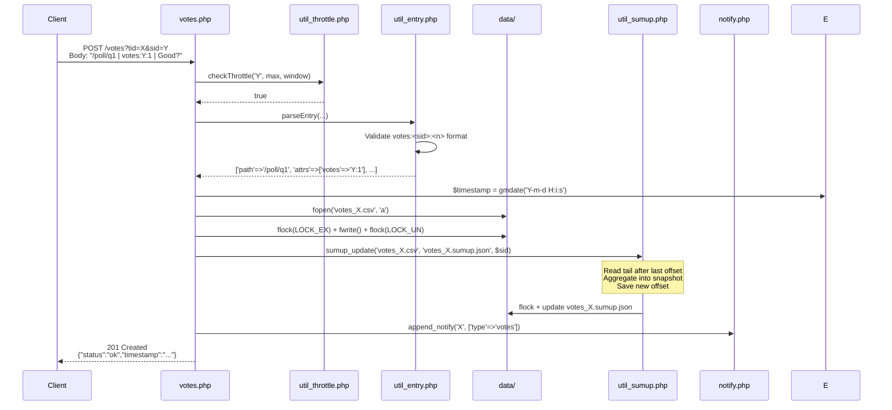
```mermaid
sequenceDiagram
    participant C as Client
    participant V as votes.php
    participant T as util_throttle.php
    participant U as util_entry.php
    participant D as data/
    participant S as util_sumup.php
    participant N as notify.php

    C->>V: POST /votes?tid=X&sid=Y<br/>Body: "/poll/q1 | votes:Y:1 | Good?"
    
    V->>T: checkThrottle('Y', max, window)
    T-->>V: true
    
    V->>U: parseEntry(...)
    U->>U: Validate votes:<sid>:<n> format
    U-->>V: ['path'=>'/poll/q1', 'attrs'=>['votes'=>'Y:1'], ...]
    
    V->>E: $timestamp = gmdate('Y-m-d H:i:s')
    V->>D: fopen('votes_X.csv', 'a')
    V->>D: flock(LOCK_EX) + fwrite() + flock(LOCK_UN)
    
    V->>S: sumup_update('votes_X.csv', 'votes_X.sumup.json', $sid)
    Note over S: Read tail after last offset<br/>Aggregate into snapshot<br/>Save new offset
    S->>D: flock + update votes_X.sumup.json
    
    V->>N: append_notify('X', ['type'=>'votes'])
    
    V-->>C: 201 Created<br/>{"status":"ok","timestamp":"..."}
```

**Vote Aggregation (Sumup):**

```json
// votes_X.sumup.json structure
{
  "src": "votes_X.csv",
  "offset": 1234,
  "nodes": {
    "/poll/q1": {
      "votes": {
        "sid_abc": {"count": 3, "signers": ["sid_abc"]},
        "sid_def": {"count": -1, "signers": ["sid_def"]}
      },
      "newest_ts": "2026-07-11 12:34:56",
      "content": "Good?"
    }
  }
}
```

**Projection (in GET /votes):**

- Own session: `votes:<sid>:<own_total>`
- Others: `votes:others:<sum_of_all_other_sids>`
- Result: `/poll/q1 | votes:sid_abc:3 | votes:others:-1 | Good?`

**Key Points:**
- Votes CSV is append-only (no deletion)
- Sumup snapshot enables O(tail) aggregation instead of O(full CSV)
- Concurrent writes safe via `flock(LOCK_EX)`
- Vote changes always trigger full `/votes` re-fetch (no incremental client-side aggregation yet)

---

### 2.4 Add Notification

**Trigger:** Explicit server-side call to `append_notify()` or automatic on CSV write.  
**Use Case:** [UC-S4: Notification Broadcasting](./api-use-cases.md#uc-s4-notification-broadcasting)

#### Process

1. Server code calls `append_notify($tid, $event)`
2. Event written to `notify_<tid>.jsonl` (one JSON object per line)
3. All connected long-poll clients receive event on next wake cycle

#### Sequence Diagram

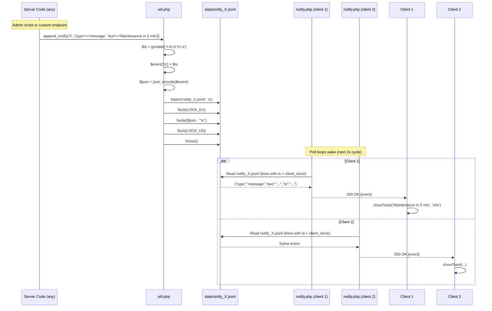
```mermaid
sequenceDiagram
    participant S as Server Code (any)
    participant U as util.php
    participant D as data/notify_X.jsonl
    participant N1 as notify.php (client 1)
    participant N2 as notify.php (client 2)
    participant C1 as Client 1
    participant C2 as Client 2

    Note over S: Admin script or custom endpoint
    S->>U: append_notify('X', ['type'=>'message', 'text'=>'Maintenance in 5 min'])
    
    U->>U: $ts = gmdate('Y-m-d H:i:s')
    U->>U: $event['ts'] = $ts
    U->>U: $json = json_encode($event)
    
    U->>D: fopen('notify_X.jsonl', 'a')
    U->>D: flock(LOCK_EX)
    U->>D: fwrite($json . "\n")
    U->>D: flock(LOCK_UN)
    U->>D: fclose()
    
    Note over N1,N2: Poll loops wake (next 2s cycle)
    
    par Client 1
        N1->>D: Read notify_X.jsonl (lines with ts > client_since)
        D-->>N1: {"type":"message","text":"...","ts":"..."}
        N1-->>C1: 200 OK [event]
        C1->>C1: showToast('Maintenance in 5 min', 'info')
    and Client 2
        N2->>D: Read notify_X.jsonl (lines with ts > client_since)
        D-->>N2: Same event
        N2-->>C2: 200 OK [event]
        C2->>C2: showToast(...)
    end
```

**Event Types:**

| Type | Payload | Trigger |
|------|---------|---------|
| `entries` | `{"type":"entries","ts":"..."}` | Automatic on POST /entries or CSV write |
| `votes` | `{"type":"votes","ts":"..."}` | Automatic on POST /votes or CSV write |
| `message` | `{"type":"message","text":"...","ts":"..."}` | Explicit `append_notify()` call |

**File Format (notify_X.jsonl):**

```
{"type":"entries","ts":"2026-07-11 12:34:56"}
{"type":"votes","ts":"2026-07-11 12:35:10"}
{"type":"message","text":"System maintenance in 5 minutes","ts":"2026-07-11 12:40:00"}
```

**Key Points:**
- JSONL format: one event per line, no commas, no array wrapper
- Events include `ts` field for filtering by `since`
- Automatic append on CSV writes (belt-and-suspenders with mtime check)
- No rotation yet (file grows unbounded) — future: see [2.5](#25-switch-notification-partition)

---

### 2.5 Switch Notification Partition

**Trigger:** Notification file exceeds size limit or retention time.  
**Use Case:** [UC-S5: Notification Partition Rotation](./api-use-cases.md#uc-s5-notification-partition-rotation)  
**Status:** **Not yet implemented** — planned for incremental notify feature.

#### Planned Process

1. Active partition: `notify_<tid>_a.jsonl`
2. Inactive partition: `notify_<tid>_b.jsonl`
3. Both partitions written in parallel (dual-write)
4. Rotation triggered when active partition is old + oversized
5. Swap: inactive becomes active, old active archived/deleted

#### Planned Sequence Diagram

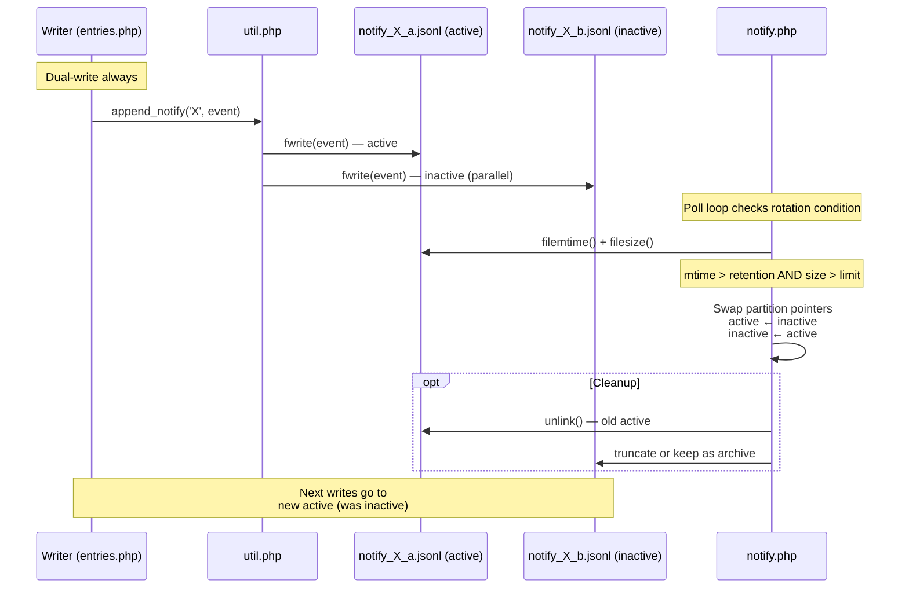
```mermaid
sequenceDiagram
    participant W as Writer (entries.php)
    participant U as util.php
    participant DA as notify_X_a.jsonl (active)
    participant DB as notify_X_b.jsonl (inactive)
    participant N as notify.php

    Note over W: Dual-write always
    W->>U: append_notify('X', event)
    U->>DA: fwrite(event) — active
    U->>DB: fwrite(event) — inactive (parallel)
    
    Note over N: Poll loop checks rotation condition
    N->>DA: filemtime() + filesize()
    Note over N: mtime > retention AND size > limit
    
    N->>N: Swap partition pointers<br/>active ← inactive<br/>inactive ← active
    
    opt Cleanup
        N->>DA: unlink() — old active
        N->>DB: truncate or keep as archive
    end
    
    Note over W,DB: Next writes go to<br/>new active (was inactive)
```

**Rotation Conditions:**

```php
// In notify.php (planned)
$retention = (int)($config['notify_retention'] ?? 60);  // seconds
$max_size = (int)($config['notify_max_size'] ?? 1048576);  // bytes

$active_file = "data/notify_{$tid}_a.jsonl";
$mtime = filemtime($active_file);
$size = filesize($active_file);

if ($size > 0 && (time() - $mtime > $retention) && $size > $max_size) {
    rotate_partition($tid);
}
```

**Key Points:**
- Dual-write ensures no message loss during rotation
- Inactive partition is pre-filled with messages beyond retention window
- Clients outside retention window get `re_sync_required` event
- Rotation is atomic from client perspective (no mid-rotation corruption)

**Future Enhancement:**
- Composite cursor: `(ts, msgid)` for precise deduplication
- Gap detection (optional)
- Archive old partitions instead of deletion

---

### 2.6 Full Data from Entries/Votes Log

**Trigger:** GET request without `since` parameter, or cache rebuild.  
**Use Case:** [UC-S6: Full Data Export](./api-use-cases.md#uc-s6-full-data-export)

#### Process (Entries)

1. Read full CSV file
2. Sort by path (column 1), dedup by latest timestamp
3. Apply delete markers (`--`)
4. Format and respond

#### Sequence Diagram (Entries, sumup disabled)

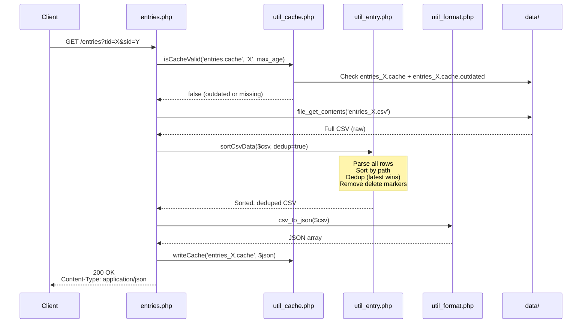
```mermaid
sequenceDiagram
    participant C as Client
    participant E as entries.php
    participant Ca as util_cache.php
    participant U as util_entry.php
    participant F as util_format.php
    participant D as data/

    C->>E: GET /entries?tid=X&sid=Y
    
    E->>Ca: isCacheValid('entries.cache', 'X', max_age)
    Ca->>D: Check entries_X.cache + entries_X.cache.outdated
    Ca-->>E: false (outdated or missing)
    
    E->>D: file_get_contents('entries_X.csv')
    D-->>E: Full CSV (raw)
    
    E->>U: sortCsvData($csv, dedup=true)
    Note over U: Parse all rows<br/>Sort by path<br/>Dedup (latest wins)<br/>Remove delete markers
    U-->>E: Sorted, deduped CSV
    
    E->>F: csv_to_json($csv)
    F-->>E: JSON array
    
    E->>Ca: writeCache('entries_X.cache', $json)
    
    E-->>C: 200 OK<br/>Content-Type: application/json
```

#### Sequence Diagram (Entries, sumup enabled)

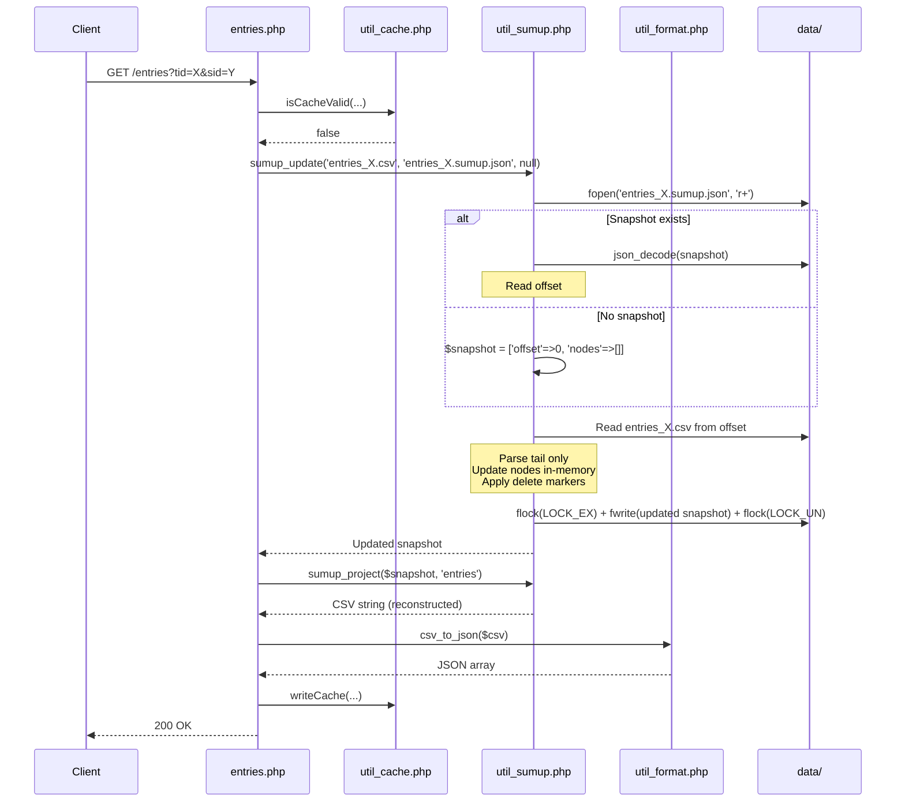
```mermaid
sequenceDiagram
    participant C as Client
    participant E as entries.php
    participant Ca as util_cache.php
    participant S as util_sumup.php
    participant F as util_format.php
    participant D as data/

    C->>E: GET /entries?tid=X&sid=Y
    
    E->>Ca: isCacheValid(...)
    Ca-->>E: false
    
    E->>S: sumup_update('entries_X.csv', 'entries_X.sumup.json', null)
    
    S->>D: fopen('entries_X.sumup.json', 'r+')
    alt Snapshot exists
        S->>D: json_decode(snapshot)
        Note over S: Read offset
    else No snapshot
        S->>S: $snapshot = ['offset'=>0, 'nodes'=>[]]
    end
    
    S->>D: Read entries_X.csv from offset
    Note over S: Parse tail only<br/>Update nodes in-memory<br/>Apply delete markers
    
    S->>D: flock(LOCK_EX) + fwrite(updated snapshot) + flock(LOCK_UN)
    S-->>E: Updated snapshot
    
    E->>S: sumup_project($snapshot, 'entries')
    S-->>E: CSV string (reconstructed)
    
    E->>F: csv_to_json($csv)
    F-->>E: JSON array
    
    E->>Ca: writeCache(...)
    E-->>C: 200 OK
```

**Key Points:**
- Sumup snapshots enable O(tail) instead of O(full file)
- Output is byte-compatible with `sortCsvData()` (verified by golden tests)
- `?refresh=1` forces snapshot discard and full rebuild (throttled)
- Cache sits on top of sumup (two-tier optimization)

#### Process (Votes)

1. Read votes CSV file
2. Load/update sumup snapshot (aggregate by path + sid)
3. Project for requesting session (`votes:<sid>:<n>` + `votes:others:<n>`)
4. Format and respond

#### Sequence Diagram (Votes)

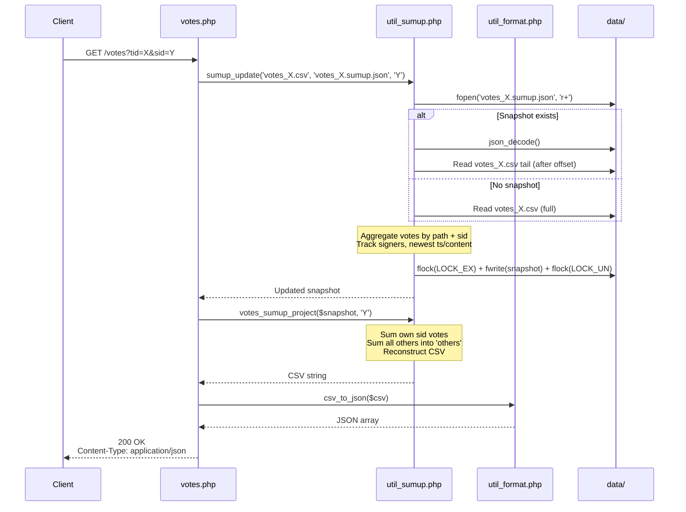
```mermaid
sequenceDiagram
    participant C as Client
    participant V as votes.php
    participant S as util_sumup.php
    participant F as util_format.php
    participant D as data/

    C->>V: GET /votes?tid=X&sid=Y
    
    V->>S: sumup_update('votes_X.csv', 'votes_X.sumup.json', 'Y')
    
    S->>D: fopen('votes_X.sumup.json', 'r+')
    alt Snapshot exists
        S->>D: json_decode()
        S->>D: Read votes_X.csv tail (after offset)
    else No snapshot
        S->>D: Read votes_X.csv (full)
    end
    
    Note over S: Aggregate votes by path + sid<br/>Track signers, newest ts/content
    
    S->>D: flock(LOCK_EX) + fwrite(snapshot) + flock(LOCK_UN)
    S-->>V: Updated snapshot
    
    V->>S: votes_sumup_project($snapshot, 'Y')
    Note over S: Sum own sid votes<br/>Sum all others into 'others'<br/>Reconstruct CSV
    S-->>V: CSV string
    
    V->>F: csv_to_json($csv)
    F-->>V: JSON array
    
    V-->>C: 200 OK<br/>Content-Type: application/json
```

**Vote Aggregation Example:**

Raw CSV:
```csv
2026-07-11 12:00:00,"/poll/q1 | votes:sid_a:1 | Good?"
2026-07-11 12:05:00,"/poll/q1 | votes:sid_b:2 | Good?"
2026-07-11 12:10:00,"/poll/q1 | votes:sid_a:1 | Good?"
```

Snapshot (after aggregation):
```json
{
  "nodes": {
    "/poll/q1": {
      "votes": {
        "sid_a": {"count": 2, "signers": ["sid_a"]},
        "sid_b": {"count": 2, "signers": ["sid_b"]}
      },
      "newest_ts": "2026-07-11 12:10:00",
      "content": "Good?"
    }
  }
}
```

Projected for sid_a:
```csv
2026-07-11 12:10:00,"/poll/q1 | votes:sid_a:2 | votes:others:2 | Good?"
```

**Key Points:**
- Votes always fully aggregated (no incremental client-side aggregation yet)
- Sumup enables O(tail) updates on POST /votes
- Cache layer not used for votes (always fresh from sumup)
- `signers` array tracks unique session IDs (future feature for confirmation list)

---

### 2.7 SumUp Operations

**Use Case:** [UC-S7: SumUp Snapshot Management](./api-use-cases.md#uc-s7-sumup-snapshot-management)

SumUp snapshots enable incremental aggregation of CSV append-only logs. Four operations:

#### 2.7.1 Init (First Read)

**Trigger:** First GET request to a tenant, or after `just sumup-clean`.

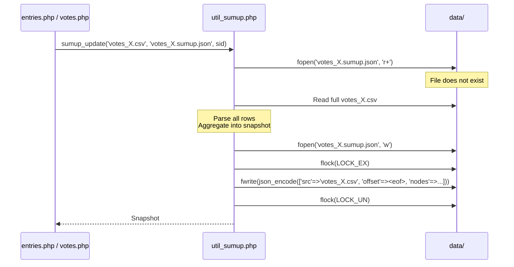
```mermaid
sequenceDiagram
    participant E as entries.php / votes.php
    participant S as util_sumup.php
    participant D as data/

    E->>S: sumup_update('votes_X.csv', 'votes_X.sumup.json', sid)
    S->>D: fopen('votes_X.sumup.json', 'r+')
    Note over D: File does not exist
    
    S->>D: Read full votes_X.csv
    Note over S: Parse all rows<br/>Aggregate into snapshot
    
    S->>D: fopen('votes_X.sumup.json', 'w')
    S->>D: flock(LOCK_EX)
    S->>D: fwrite(json_encode(['src'=>'votes_X.csv', 'offset'=><eof>, 'nodes'=>...]))
    S->>D: flock(LOCK_UN)
    
    S-->>E: Snapshot
```

**Key Points:**
- Full CSV read on first access (cold start)
- Subsequent reads use incremental mode
- Init is O(full file), but only happens once per tenant

---

#### 2.7.2 Running Delta (Incremental Update)

**Trigger:** GET request when snapshot exists and is valid.

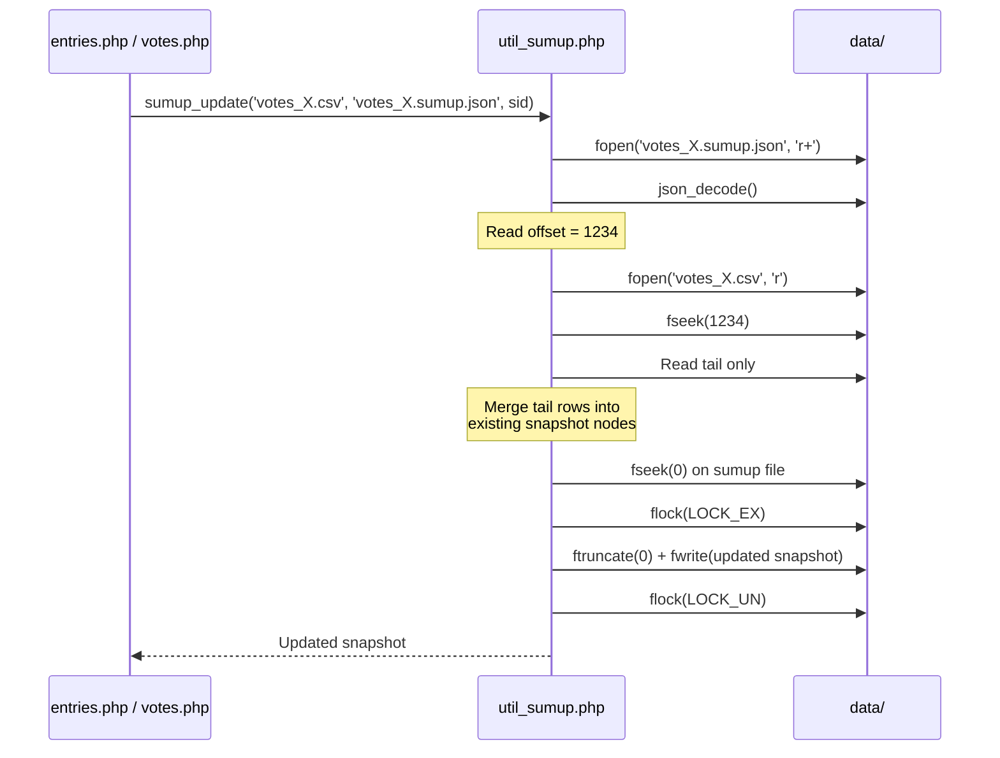
```mermaid
sequenceDiagram
    participant E as entries.php / votes.php
    participant S as util_sumup.php
    participant D as data/

    E->>S: sumup_update('votes_X.csv', 'votes_X.sumup.json', sid)
    S->>D: fopen('votes_X.sumup.json', 'r+')
    S->>D: json_decode()
    Note over S: Read offset = 1234
    
    S->>D: fopen('votes_X.csv', 'r')
    S->>D: fseek(1234)
    S->>D: Read tail only
    
    Note over S: Merge tail rows into<br/>existing snapshot nodes
    
    S->>D: fseek(0) on sumup file
    S->>D: flock(LOCK_EX)
    S->>D: ftruncate(0) + fwrite(updated snapshot)
    S->>D: flock(LOCK_UN)
    
    S-->>E: Updated snapshot
```

**Key Points:**
- Read CSV tail only (after stored offset)
- O(tail) complexity, not O(full file)
- Offset advances to new EOF
- Concurrent reads safe (older-snapshot-wins on conflict)

---

#### 2.7.3 Increment (Append on Write)

**Trigger:** POST /votes or POST /entries (if sumup enabled for entries).

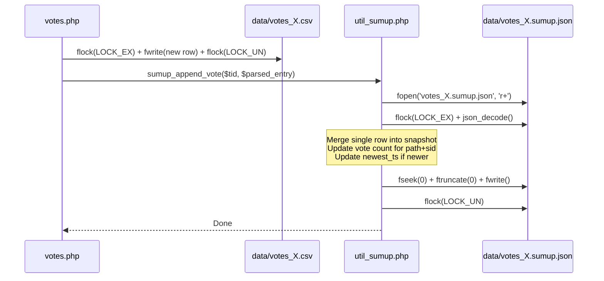
```mermaid
sequenceDiagram
    participant V as votes.php
    participant D as data/votes_X.csv
    participant S as util_sumup.php
    participant DS as data/votes_X.sumup.json

    V->>D: flock(LOCK_EX) + fwrite(new row) + flock(LOCK_UN)
    
    V->>S: sumup_append_vote($tid, $parsed_entry)
    
    S->>DS: fopen('votes_X.sumup.json', 'r+')
    S->>DS: flock(LOCK_EX) + json_decode()
    
    Note over S: Merge single row into snapshot<br/>Update vote count for path+sid<br/>Update newest_ts if newer
    
    S->>DS: fseek(0) + ftruncate(0) + fwrite()
    S->>DS: flock(LOCK_UN)
    
    S-->>V: Done
```

**Key Points:**
- Append updates snapshot immediately (no stale reads)
- Single row merge is O(1)
- Lock ordering: CSV first, then sumup (prevents deadlock)
- Offset incremented by byte count of appended row

---

#### 2.7.4 Re-create (Full Rebuild)

**Trigger:** `?refresh=1` query param (throttled), or corrupted snapshot detected.

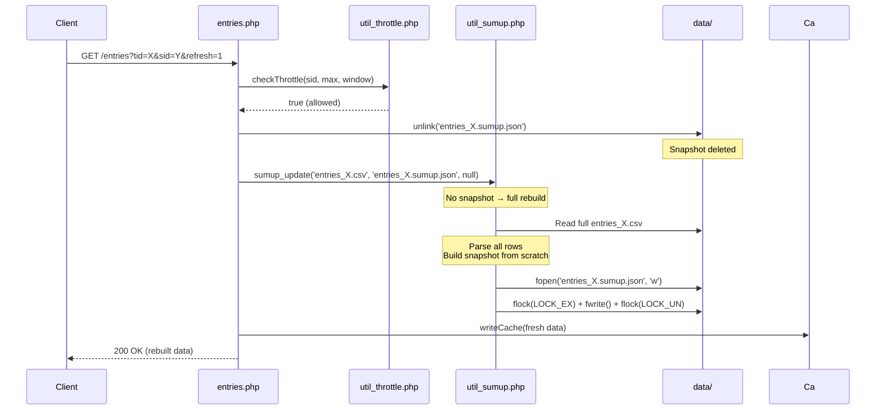
```mermaid
sequenceDiagram
    participant C as Client
    participant E as entries.php
    participant T as util_throttle.php
    participant S as util_sumup.php
    participant D as data/

    C->>E: GET /entries?tid=X&sid=Y&refresh=1
    
    E->>T: checkThrottle(sid, max, window)
    T-->>E: true (allowed)
    
    E->>D: unlink('entries_X.sumup.json')
    Note over D: Snapshot deleted
    
    E->>S: sumup_update('entries_X.csv', 'entries_X.sumup.json', null)
    Note over S: No snapshot → full rebuild
    
    S->>D: Read full entries_X.csv
    Note over S: Parse all rows<br/>Build snapshot from scratch
    
    S->>D: fopen('entries_X.sumup.json', 'w')
    S->>D: flock(LOCK_EX) + fwrite() + flock(LOCK_UN)
    
    E->>Ca: writeCache(fresh data)
    E-->>C: 200 OK (rebuilt data)
```

**Key Points:**
- Throttled to prevent abuse (same as cache refresh)
- Deletes snapshot before rebuild (ensures clean state)
- Full rebuild is O(full file), but rare
- Used for recovery after corruption or offset mismatch

**Offset Mismatch Detection:**

```php
// In util_sumup.php
$snapshot = json_decode(file_get_contents($sumup_file), true);
$csv_size = filesize($csv_file);

if ($snapshot['offset'] > $csv_size) {
    // CSV was truncated or replaced → full rebuild
    unlink($sumup_file);
    return sumup_init($csv_file, $sumup_file, $sid);
}
```

---

## 3. Data Flow Architecture

### 3.1 Write Path Overview

```
Client
  │
  ├─ POST /entries ──┬─▶ entries.php
  │                  │    ├─ Validate + throttle
  │                  │    ├─ Append to entries_X.csv (flock)
  │                  │    ├─ touchOutdated(cache)
  │                  │    ├─ append_notify(['type'=>'entries'])
  │                  │    └─ sumup_append_entry() (if enabled)
  │                  │
  ├─ POST /votes ────┬─▶ votes.php
  │                  │    ├─ Validate + throttle
  │                  │    ├─ Append to votes_X.csv (flock)
  │                  │    ├─ sumup_append_vote() (always enabled)
  │                  │    └─ append_notify(['type'=>'votes'])
  │                  │
  └─ (Server code) ──┬─▶ util.php::append_notify()
                     │    └─ Append to notify_X.jsonl (flock)
                     │
                     ▼
               data/ files
```

### 3.2 Read Path Overview

```
Client
  │
  ├─ GET /entries ───┬─▶ entries.php
  │                  │    ├─ isCacheValid() ?
  │                  │    ├─ YES → readCache() → respond
  │                  │    └─ NO  → sumup_update() / sortCsvData()
  │                  │           → csv_to_json() → writeCache() → respond
  │                  │
  ├─ GET /votes ─────┬─▶ votes.php
  │                  │    ├─ sumup_update() (always, no cache)
  │                  │    ├─ votes_sumup_project(sid)
  │                  │    └─ csv_to_json() → respond
  │                  │
  └─ GET /notify ────┬─▶ notify.php
                     │    ├─ Poll loop (≤25s)
                     │    ├─ clearstatcache() + filemtime() every 2s
                     │    ├─ Check entries_X.csv, votes_X.csv mtime
                     │    ├─ Read notify_X.jsonl (lines with ts > since)
                     │    └─ Respond [events] or 204 on timeout
                     │
                     ▼
               Client processes events
```

### 3.3 Consistency Guarantees

| Scenario | Guarantee | Mechanism |
|----------|-----------|-----------|
| Concurrent writes to same CSV | Last write wins (atomic append) | `flock(LOCK_EX)` |
| Read during write | Read sees old or new state, never partial | `flock(LOCK_SH)` (optional, not enforced yet) |
| Sumup snapshot vs CSV tail | Snapshot eventually consistent | Offset-based tail merge |
| Cache vs CSV | Cache valid until `touchOutdated()` | `.outdated` marker file |
| Notify events vs CSV mtime | Both fire (belt-and-suspenders) | Explicit append + mtime check |
| Multiple notify.php clients | All receive same events | Stateless file reads |

**No Guarantees:**
- Global transaction ordering across tenants (not needed)
- Exactly-once delivery of notify events (clients must deduplicate by path)
- Real-time precision < 2s (poll interval)

---

## 4. Configuration Reference

**File:** `infopedia.cfg`

### General Section

```ini
[general]
throttle_max    = 10        ; 0 = disabled, >0 = max requests per window
throttle_window = 60        ; seconds
throttle_key    = sid       ; 'sid' or 'ip'
poll_timeout    = 25        ; seconds (notify.php hold time)
```

### Entry Section

```ini
[entry]
sumup_enabled = false       ; true = use snapshot for entries (burn-in phase)
data_dir      = data/       ; CSV file location
cache_dir     = data/       ; Cache file location
cache_max_age = 300         ; seconds (5 min)
cache_delay   = 5           ; seconds (outdated marker grace period)
```

### Vote Section

```ini
[vote]
; sumup always enabled for votes (required for aggregation)
cache_max_age = 60          ; seconds (votes not cached currently, future use)
```

### Notify Section (planned)

```ini
[notify]
retention       = 60        ; seconds (incremental file coverage)
max_size        = 1048576   ; bytes (rotation trigger)
```

---

## 5. Troubleshooting

### 5.1 Client Not Receiving Updates

**Symptoms:** Client shows stale data, notify events not firing.

**Checks:**
1. Verify notify.php responding: `curl "http://localhost/notify?tid=X&since=2020-01-01%2000:00:00"` (should hold ~25s)
2. Check CSV mtime: `ls -la data/entries_X.csv` (should advance on POST)
3. Check notify log: `tail -f data/notify_X.jsonl` (should have events)
4. Check browser console: poll should reconnect after 200/204

**Fixes:**
- `poll_timeout = 2` in config for faster testing
- `clearstatcache()` in notify.php (already present)
- Verify `append_notify()` called after CSV write

---

### 5.2 Sumup Snapshot Out of Sync

**Symptoms:** Vote counts wrong, entries missing or duplicated.

**Checks:**
1. Compare snapshot offset to CSV size: `ls -la data/votes_X.{csv,sumup.json}`
2. Verify offset <= CSV size (if >, CSV was replaced → rebuild needed)
3. Check snapshot `src` field matches current CSV filename

**Fixes:**
- Force rebuild: `GET /votes?tid=X&refresh=1` (throttled)
- Delete snapshot: `rm data/votes_X.sumup.json` (next read rebuilds)
- Admin tool: `just sumup-clean` (deletes all snapshots)

---

### 5.3 Cache Stale Despite Writes

**Symptoms:** GET /entries returns old data, `.outdated` marker exists.

**Checks:**
1. Verify `.outdated` file: `ls -la data/entries_X.cache.outdated`
2. Check cache age vs `cache_max_age` config
3. Verify `touchOutdated()` called in POST handler

**Fixes:**
- Increase `cache_delay` (grace period for multiple rapid writes)
- Force refresh: `GET /entries?tid=X&refresh=1`
- Manual: `touch data/entries_X.cache.outdated`

---

### 5.4 Throttle Blocking Legitimate Requests

**Symptoms:** 429 Too Many Requests on normal usage.

**Checks:**
1. Check throttle state: `cat data/throttle_<sid>.dat` → `<window_start>:<count>`
2. Verify `throttle_max` and `throttle_window` in config
3. Check if multiple clients share same sid (should be unique per browser)

**Fixes:**
- Increase `throttle_max` or `throttle_window`
- Set `throttle_max = 0` to disable (not recommended for production)
- Clear throttle state: `rm data/throttle_*.dat`
- Ensure sid uniqueness (client-generated GUID)

---

## 6. Related Documents

- [API Specification](../.ai/api_spec.md) — Endpoint contracts and data formats
- [Backend Communication Concept](./backend-communication-concept.md) — Incremental notify design (future)
- [Backend Communication](./backend-communication.md) — Current notify implementation
- [API Use Cases](./api-use-cases.md) — Detailed technical use cases
- [App2 Use Cases](./app2-use-cases.md) — User-facing use cases
- [App2 Spec](./app2-spec.md) — Frontend implementation details

---

## 7. Future Enhancements

### 7.1 Incremental Notify Payload Delivery

**Status:** Designed (see backend-communication-concept.md), not implemented

**Changes:**
- Notify response includes `entries` and `votes` arrays (actual data, not just event type)
- Client uses `(ts, msgid)` cursor for precise positioning
- Rotating notify files with dual-write guarantee
- Retention window enforcement (clients outside window get `re_sync_required`)

**Benefits:**
- Eliminates separate GET /entries after notify event (one round-trip)
- Enables incremental vote aggregation on client side (future)
- Reduces server load (no full CSV reads on every poll)

---

### 7.2 Client-Side Vote Aggregation

**Status:** Design gap (see backend-communication-concept.md)

**Changes:**
- Notify delivers raw vote rows: `{"path":"/poll/q1","votes":"sid_a:1","ts":"..."}`
- Client maintains local vote aggregation store
- No more full `/votes` re-fetch on every vote event

**Benefits:**
- Truly incremental votes (currently hybrid: incremental server, full client)
- Lower bandwidth on high-vote tenants
- Enables real-time vote animations (smooth count transitions)

---

### 7.3 Entry Sumup Default-On

**Status:** Implemented but disabled by default (burn-in phase)

**Timeline:**
- After 30 days production use with zero snapshot corruption incidents
- Config flip: `[entry] sumup_enabled = true`
- Backward compatible (old tenants rebuild snapshot on first read)

**Benefits:**
- O(tail) entry reads for all tenants
- Scales to millions of entries per tenant
- Unified code path with votes (less maintenance)

---

**Last Updated:** 2026-07-11  
**Maintainer:** InfoPedia Backend Team

